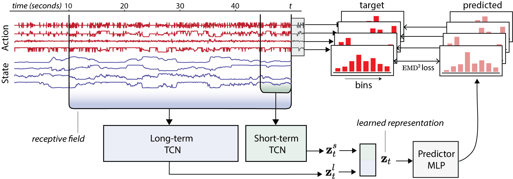

# Relax, it doesn't matter how you get there: A new self-supervised approach for multi-timescale behavior analysis (NeurIPS 2023)



This is the official PyTorch implementation of BAMS in 'Relax, it doesn't matter how you get there: A new self-supervised approach for multi-timescale behavior analysis' (NeurIPS 2023).

The main scripts are `mouse_triplets.py` and `fruit_flies.py`` used for training on the MABe datasets.

### Setup

Clone this repository:
```bash
git clone https://github.com/nerdslab/bams.git
```

To set up a Python virtual environment with the required dependencies, run:
```bash
python3 -m venv bams_env
source bams_env/bin/activate
pip install --upgrade pip
pip install -e .
```

### Downloading the MABe data

Run the following script to download the MABe data (both mouse triplet and fruit fly datasets):
```bash
bash download_mabe.sh
```

## Mouse Triplet experiments

To start training, run:
```bash
python3 mouse_triplets.py --job train
```

You can track the runs in Tensorboard:
```bash
tensorboard --logdir runs
```

To compute the learned representations and save them to a file, run:
```bash
python3 mouse_triplets.py --job compute_representations --ckpt_path ./bams-mouse-triplet-2023-12-04-14-42-44.pt
```

For linear evaluation of the learned representations, we will use the public
MABe evaluator:
```bash
python3 round1_evaluator.py --task mouse --submission ../bams-mouse-triplet-2023-11-30-17-49-59_submission.npy --labels ../data/mabe/mouse_triplets_test_labels.npy
```

## Custom datasets

To train BAMS on a custom dataset, refer to `custom_dataset.py`, you will need to
simply load your `keypoints` object which should be of shape `(n_samples, seq_len, num_feats)`. If you have missing values, or need to pad your data to the same length, please use `np.nan` as the missing value.
